# Multi-GPU Pipeline Architecture for Real-Time Digital Inline Holographic Reconstruction

**CSCI 8205 — Design and Implementation of Multiprocessor Systems**
Nicholas Bravo-Frank | March 2026

---

## 1. Project Overview

This project designs and evaluates a real-time holographic processing pipeline for detecting and classifying biological particles from digital inline holograms. The pipeline has six computational stages:

1. **Image Load & Transfer** — Disk read, grayscale resize to 448x448, host-to-device transfer
2. **EMA Background Subtraction** — Exponential moving average to remove static background
3. **Holographic Reconstruction** — Angular spectrum propagation via 2D FFT across 3 depth planes
4. **Heatmap Detection** — CNN-based particle detection (MobileNetV3-Small + FPN, TensorRT)
5. **Classification** — Per-particle crop classification (YOLO11n-cls, TensorRT, batched)
6. **Post-processing** — Static centerpoint filter for temporal consistency

The pipeline is implemented in four variants across two languages and four execution targets:
- **Python CPU** — PyTorch, single-threaded (baseline)
- **Python GPU** — PyTorch CUDA / TensorRT on RTX 5090
- **C++ CPU** — OpenMP + FFTW (holographic reconstruction only)
- **C++ GPU** — CUDA + cuFFT + native TensorRT C++ API (full pipeline)

**Hardware:** NVIDIA RTX 5090 (Blackwell, 170 SMs, 105 TFLOPS FP32, 1790 GB/s GDDR7), AMD Threadripper PRO 7975WX (32 cores, Zen 4, 150 GB/s DDR5).

---

## 2. End-to-End Pipeline Performance

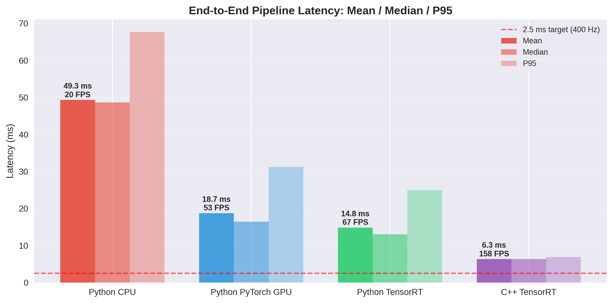

The C++ TensorRT pipeline achieves **6.3 ms mean latency (158 FPS)** sustained over 10,000 frames, a **7.8x speedup** over the Python CPU baseline and **2.3x** over the best Python GPU (TensorRT) configuration.

| Implementation | Mean (ms) | Median (ms) | P95 (ms) | FPS | vs CPU |
|---|---|---|---|---|---|
| Python CPU | 49.3 | 48.6 | 67.7 | 20 | 1.0x |
| Python PyTorch GPU | 18.7 | 16.4 | 31.2 | 53 | 2.6x |
| Python TensorRT | 14.8 | 13.1 | 25.0 | 67 | 3.3x |
| **C++ TensorRT** | **6.3** | **6.4** | **6.9** | **158** | **7.8x** |

Key observations:
- The C++ pipeline has dramatically tighter latency variance (P95/median = 1.08x) compared to Python TRT (P95/median = 1.91x), critical for real-time predictability.
- The 400 Hz camera target (2.5 ms per frame) is not yet met, but eliminating disk I/O via ring buffers would bring the compute-only latency to ~2.1 ms.

---

## 3. Stage-by-Stage Breakdown

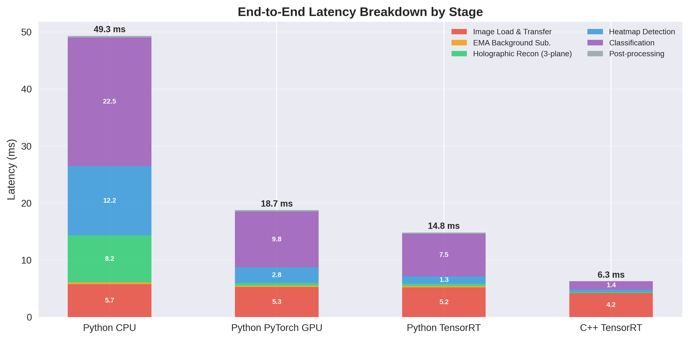

The stacked breakdown reveals a fundamental shift in the performance profile across implementations:

- **Python CPU**: Classification dominates (22.5 ms, 46% of E2E), followed by detection (12.2 ms, 25%) and reconstruction (8.2 ms, 17%).
- **C++ TensorRT**: Image loading dominates (4.2 ms, 67% of E2E). All GPU compute stages total only **2.07 ms**, suggesting ~480 FPS is achievable with preloaded frames.

The C++ port transformed the pipeline from **compute-bound** to **I/O-bound**.

---

## 4. C++ vs Python TensorRT — Per-Stage Analysis

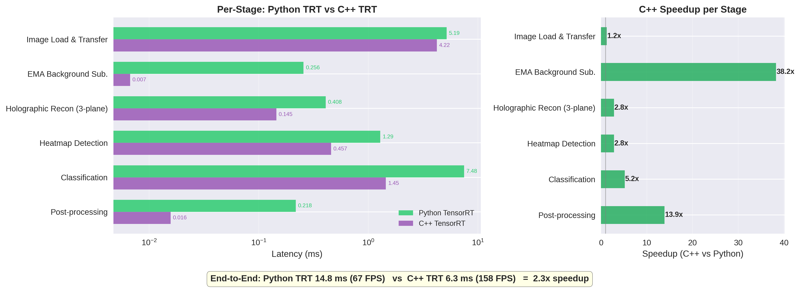

Direct comparison between the two TensorRT implementations (both using the same .engine files, same GPU):

| Stage | Python TRT | C++ TRT | Speedup | Root Cause |
|---|---|---|---|---|
| Image Load | 5.19 ms | 4.22 ms | 1.2x | Pinned memory staging vs cv2 default |
| EMA | 0.256 ms | 0.007 ms | **38.2x** | Fused CUDA kernel vs PyTorch tensor ops |
| Reconstruction | 0.408 ms | 0.145 ms | **2.8x** | Hz_stack caching, fused normalize kernel |
| Detection | 1.287 ms | 0.457 ms | **2.8x** | Native TRT C++ API vs torch2trt wrapper |
| Classification | 7.478 ms | 1.447 ms | **5.2x** | Direct TRT infer vs ultralytics overhead |
| Post-processing | 0.218 ms | 0.016 ms | **13.9x** | C++ std::vector vs Python list/numpy |

The largest speedups come from eliminating Python/framework overhead:
- **EMA (38x)**: A single fused CUDA kernel replaces multiple PyTorch tensor operations that each launch separate kernels with Python dispatch overhead.
- **Classification (5.2x)**: The ultralytics YOLO wrapper in Python performs redundant preprocessing and uses a suboptimal TensorRT execution path. The C++ implementation calls `enqueueV3()` directly.
- **Post-processing (14x)**: Pure C++ vs Python interpreter for simple data structure operations.

---

## 5. Per-Stage Speedup Over Python CPU Baseline

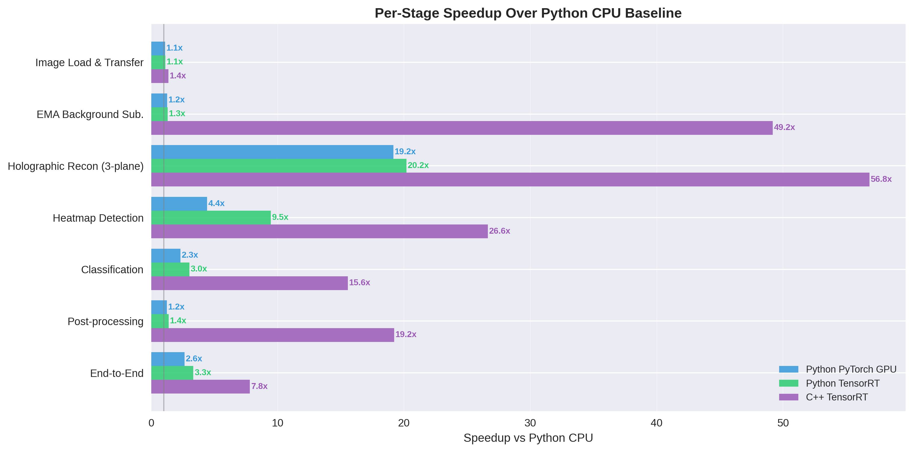

Speedup varies dramatically by stage, revealing the compute characteristics:

- **Holographic Reconstruction: 56.8x** — FFT-dominated, embarrassingly parallel across frequency bins and depth planes. Massive GPU advantage.
- **EMA: 49.2x** — Simple element-wise ops with high memory bandwidth utilization on GPU.
- **Heatmap Detection: 26.6x** — CNN inference is highly parallel but less data-parallel than FFT.
- **Classification: 15.6x** — Bottlenecked by variable batch size (0-50 crops per frame) and CPU crop extraction.
- **Image Load: 1.4x** — Disk I/O limited; GPU cannot help here.

---

## 6. Holographic Reconstruction — Scaling Analysis

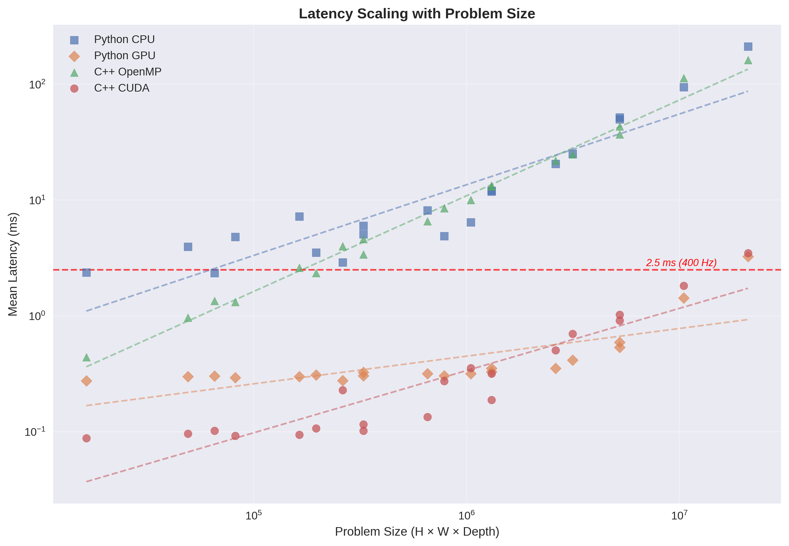

Reconstruction latency scales approximately linearly with problem size (H x W x depth) across all implementations, with consistent separation between the four implementations across 4 orders of magnitude of problem size.

The C++ CUDA implementation maintains sub-millisecond latency for all configurations up to 512x512 x 20 planes, and only exceeds the 2.5 ms budget at 1024x1024 x 20 planes (3.49 ms).

---

## 7. OpenMP Thread Scaling

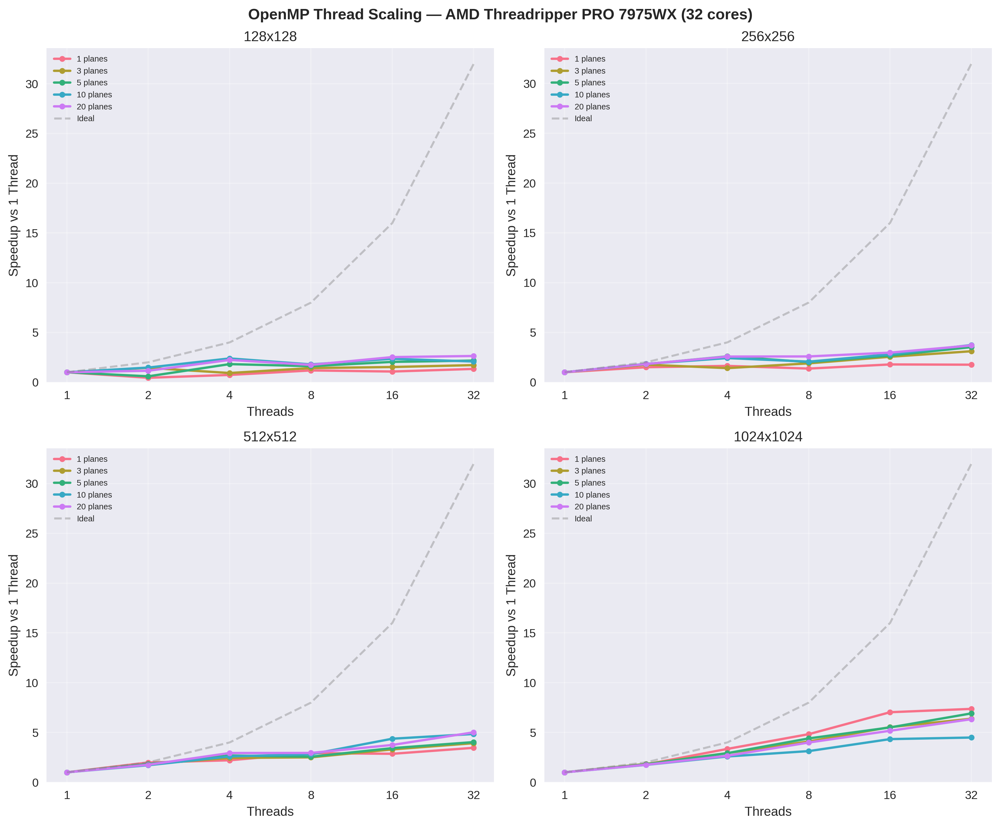

The CPU OpenMP implementation shows sub-linear scaling characteristic of memory-bandwidth-saturated workloads:

- **Small problems (128x128)**: Poor scaling — overhead exceeds benefit. Best at 32 threads but only 1.3-2.6x speedup.
- **Large problems (1024x1024)**: Better scaling — up to 7.4x with 32 threads for 1-plane, 6.3x for 20-plane.
- **64 threads**: Performance **collapses** across all sizes due to the Threadripper's NUMA topology (4 CCDs, cross-CCD memory access causes cache coherence thrashing).

The thread scaling ceiling is consistent with DRAM bandwidth saturation: 8-channel DDR5 at 150 GB/s is shared across all cores, and the 2D FFT's strided column-pass access pattern causes poor cache line utilization.

---

## 8. CUDA Reconstruction Latency Heatmap

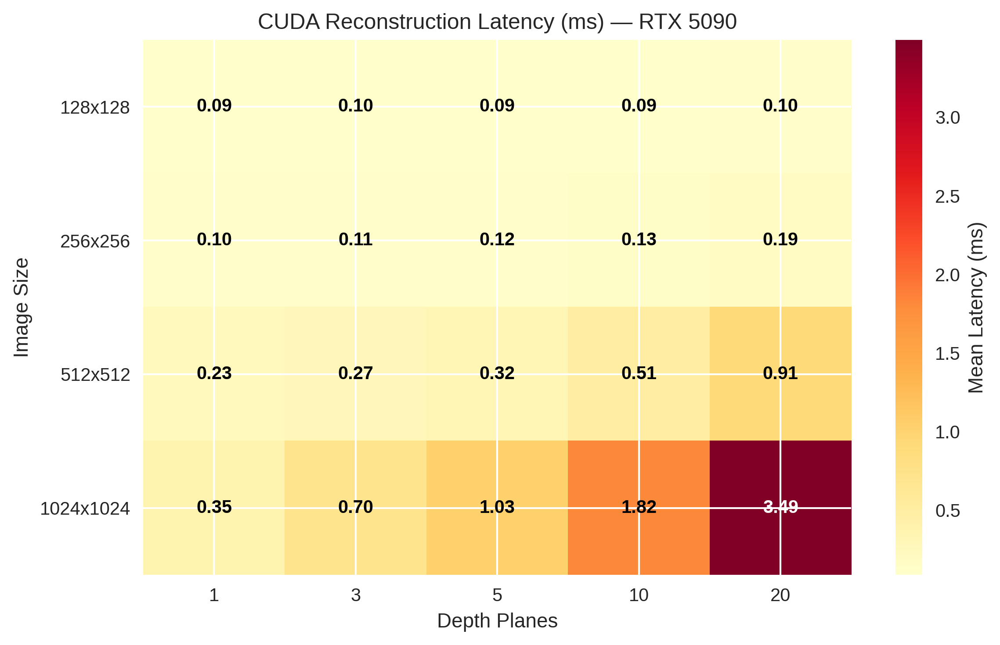

The CUDA latency heatmap across image sizes and depth counts shows:
- Latency is dominated by image size (quadratic in N due to 2D FFT)
- Depth scaling is sub-linear because the forward FFT is computed once and reused across all planes (Hz_stack caching optimization)
- The 3-plane configuration used in the pipeline (448x448) falls well within the sub-millisecond regime

---

## 9. Extended GPU Roofline — Pipeline Stage Analysis

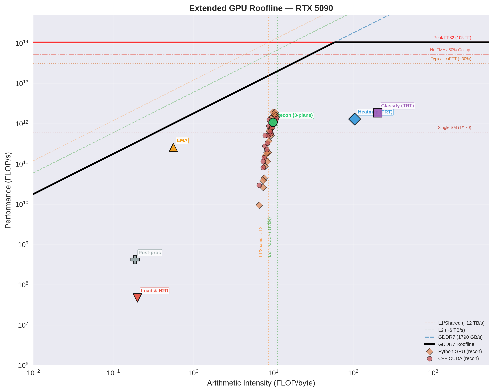

The extended roofline adds three layers of analysis beyond the naive peak-bandwidth roofline:

**Bandwidth ceilings** (diagonal lines): L1/Shared (~12 TB/s), L2 (~6 TB/s), GDDR7 (1790 GB/s). These show the maximum achievable performance at each memory hierarchy level.

**In-core computation ceilings** (horizontal lines): Peak FP32 (105 TF), No FMA / 50% Occupancy (~52.5 TF), Typical cuFFT (~31.5 TF), Single SM (617 GF). Performance cannot exceed these ceilings without addressing the corresponding parallelism limitation.

**Locality walls** (vertical dotted lines): The L1/Shared → L2 and L2 → GDDR7 transitions mark where the FFT working set spills between cache levels, degrading effective bandwidth.

The reconstruction data points (red circles) cluster at AI ~3-10 and achieve 10-100 GFLOP/s — well below the "Typical cuFFT" ceiling, indicating room for optimization through kernel fusion (cuFFTDx) and improved data locality.

---

## 10. Pipeline Stages on the Roofline

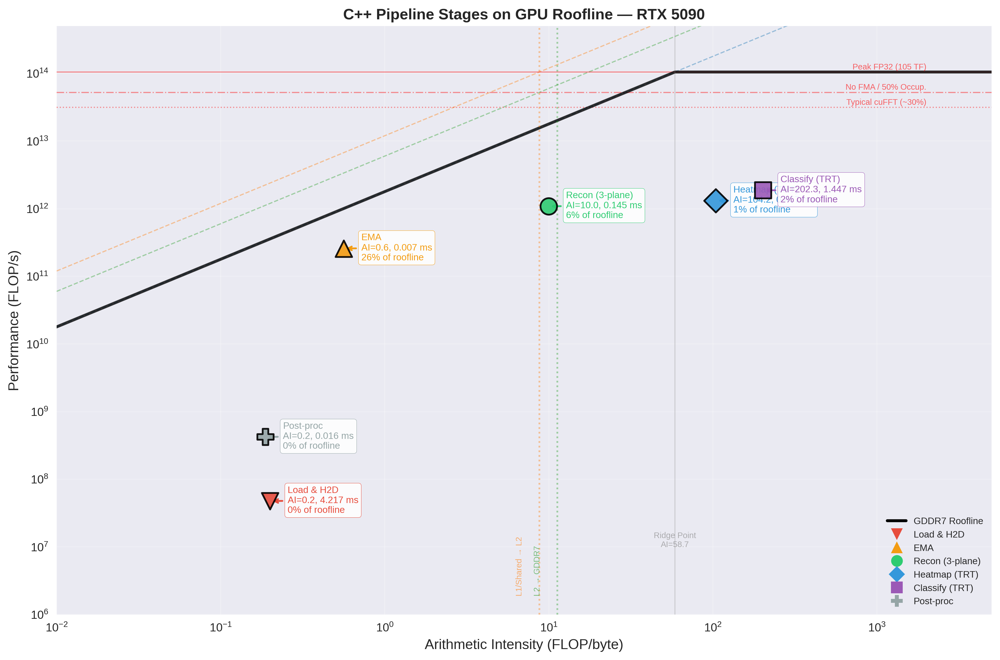

Plotting each pipeline stage on the GPU roofline reveals distinct optimization strategies per stage:

| Stage | AI (FLOP/byte) | Achieved | % of Roofline | Regime |
|---|---|---|---|---|
| Load & H2D | 0.2 | 0.05 GF/s | 0% | I/O bound (disk) |
| EMA | 0.6 | 258 GF/s | 26% | **Memory BW bound** |
| Recon (3-plane) | 10.0 | 1,085 GF/s | 6% | Below cuFFT ceiling |
| Heatmap (TRT) | 104 | 1,313 GF/s | 1.3% | Compute bound, under-utilized |
| Classify (TRT) | 202 | 1,866 GF/s | 1.8% | Compute bound, batch overhead |
| Post-proc | 0.2 | 0.4 GF/s | 0% | CPU scalar |

**Key insight:** The EMA kernel (AI=0.6) is the only stage operating efficiently relative to the roofline (26% of peak at its AI). The TRT inference stages have very high arithmetic intensity (>100) but achieve only 1-2% of peak, indicating that TensorRT's internal scheduling leaves significant GPU resources idle. This motivates concurrent execution of multiple pipeline stages via CUDA streams — a core objective of the ring buffer phase.

---

## 11. Extended CPU Roofline

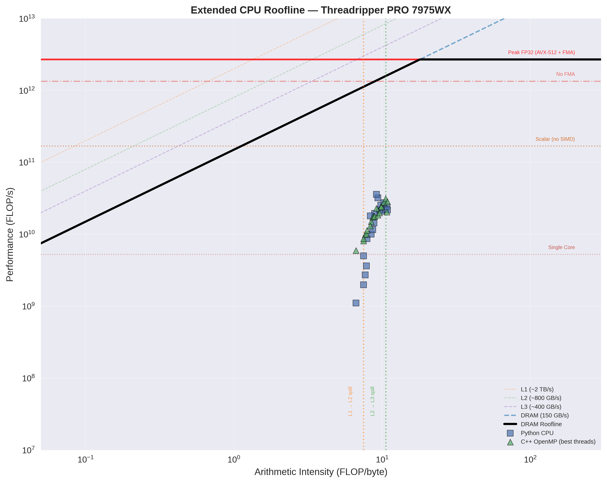

The CPU roofline with in-core ceilings reveals why the OpenMP implementation plateaus:

- All data points cluster between the "Single Core" and "Scalar (no SIMD)" ceilings, confirming that FFTW is not utilizing AVX-512 for the complex float32 FFT (FFTW defaults to SSE2/AVX2 for single-precision complex).
- Points sit near the DRAM bandwidth diagonal, confirming memory-bandwidth saturation as the primary limiter.
- The gap between C++ OpenMP (green triangles) and Python CPU (blue squares) narrows at larger problem sizes, consistent with both implementations hitting the same DRAM bandwidth ceiling.

**Optimization opportunity:** Enabling AVX-512 in FFTW (`--enable-avx512` at build time) or using Intel MKL could push points above the "Scalar" ceiling toward the "No FMA" ceiling, yielding up to 16x improvement on the CPU side.

---

## 12. Reconstruction Performance Summary

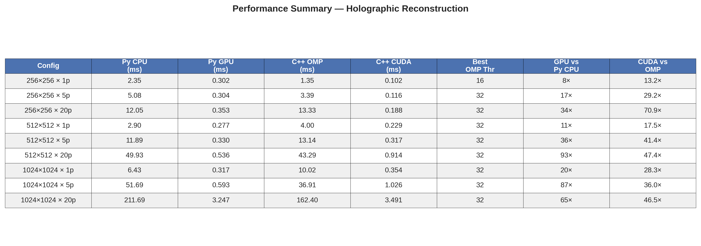

---

## 13. Current Status and Next Steps

### Completed (Weeks 1-6, ahead of schedule)
- C++/CUDA holographic reconstruction with cuFFT, validated against Python reference
- OpenMP CPU baseline with thread scaling analysis (1-64 threads)
- Full 6-stage C++ pipeline with native TensorRT C++ API
- Comprehensive benchmarking: per-stage latency, E2E throughput, 10K-frame sustained runs
- Extended roofline analysis with bandwidth ceilings, in-core ceilings, and locality walls
- Cross-implementation comparison: Python CPU/GPU vs C++ CPU/GPU

### Next Phase: Ring Buffers and Inter-Stage Communication (Weeks 7-8)

The roofline analysis identifies the critical path: **disk I/O (4.2 ms) is 67% of E2E latency**. The immediate optimization is to decouple I/O from compute using:

1. **Triple-buffered CUDA streams**: H2D, compute, and D2H running concurrently on 3 frame slots
2. **Lock-free SPSC ring buffer**: cache-line-aligned, GPU-pinned backing memory, configurable depth (8-16 frames)
3. **Pre-allocated memory pool**: all GPU buffers allocated once at startup (~80 MB total, well within 32 GB VRAM)

Expected impact: eliminating the I/O bottleneck reduces E2E to ~2.1 ms (~480 FPS), potentially meeting the 400 Hz target.

### Future Phases
- **Weeks 9-10**: Cache coherence analysis (perf/likwid), NUMA effects on ring buffer performance, multi-GPU stage partitioning
- **Weeks 11-12**: cuFFTDx kernel fusion for reconstruction, strong/weak scaling analysis, final 400 Hz feasibility evaluation
